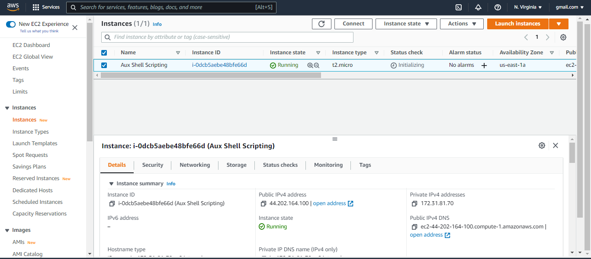
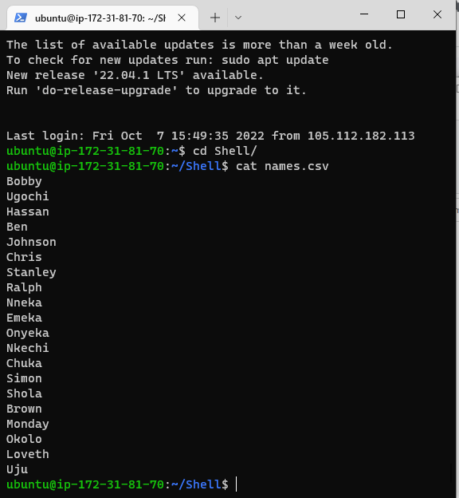
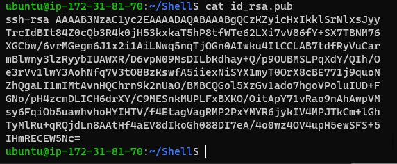
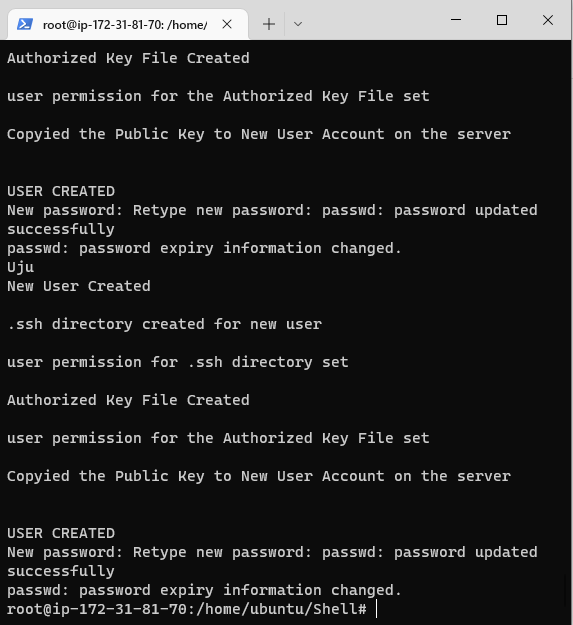
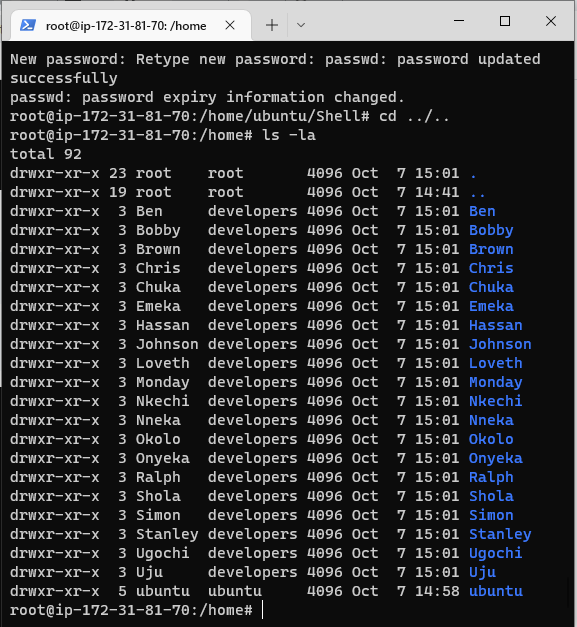
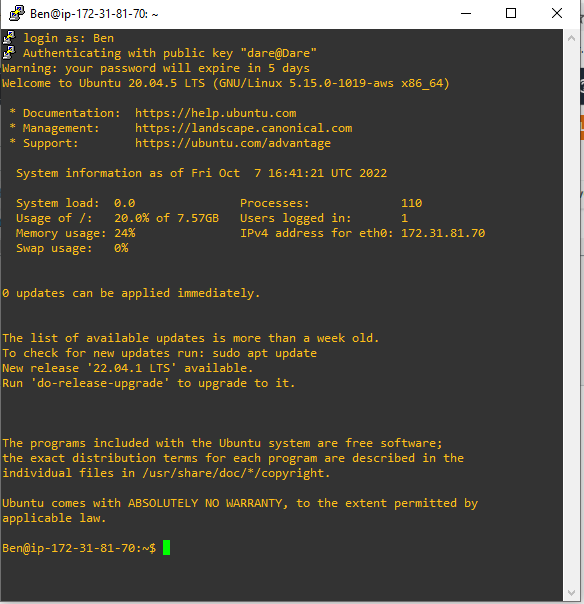

## In this project, i will onboard 20 new Linux users onto a server using shell scripting.

Lunch EC2 Instnce 

Create the project folder

`mkdir Shell`

Move into the Shell folder

`cd Shell`

Create a csv file name 

`touch names.csv`

Open the names.csv file

`vim names.csv`

Insert some random names into it. (One name per line)

Open and populate the id_rsa.pub file the public key then Save and exit.

Add shell script to automate the onboarding of 20 users then Save and exit.

Create the developers group then
Make the shell script executable

`sudo groupadd developers`

`sudo chmod +x onboarding_users.sh`

Change user to super and run script.

`sudo su`

User are created successfully

Verify the new users

`cd ../..`

`ls -la`

Testing one of the created users from putty

## Congratulations.